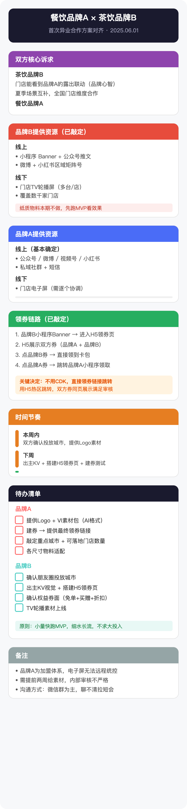
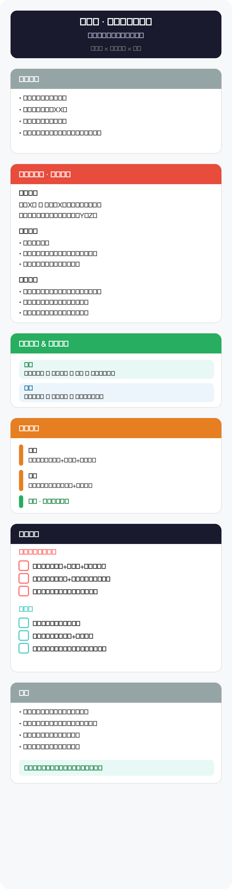
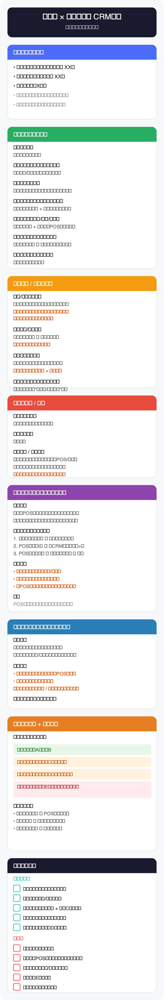
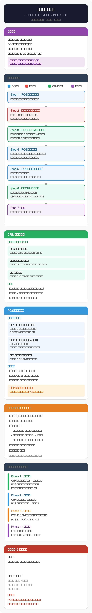
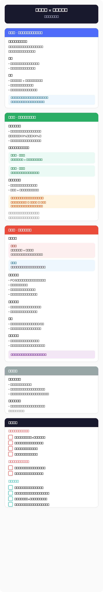

# majia-meeting-svg

[](https://skills.sh/maojiebc/majia-meeting-svg)

> **SVG 会议纪要卡片 · 马甲实战版**

一个 Claude Code Skill：把会议逐字稿变成一张手机端可直接转发的 SVG 会议纪要卡片，并自动生成 PNG 方便在微信/钉钉/飞书等 IM 中直接发送。

## 它做什么

喂入会议录音转写 / 逐字稿，产出一张结构化的 SVG 卡片——色块分模块、checkbox 列待办、时间轴标节奏。所有参会方拿到同一张图，30 秒扫完就知道「定了什么、谁做什么、什么时候」。

**输入**：多方会议的逐字稿 / 录音转写文本  
**输出**：SVG 文件 + PNG 图片（2x Retina，自动生成）

## 安装

```bash
# GitHub CLI (推荐)
gh skill install maojiebc/majia-meeting-svg

# skills.sh
npx skills add maojiebc/majia-meeting-svg

# 手动克隆
git clone https://github.com/maojiebc/majia-meeting-svg.git ~/.claude/skills/majia-meeting-svg
```

## 使用

```bash
/majia-meeting-svg path/to/transcript.txt
/majia-meeting-svg   # 然后粘贴内容
```

## 示例

[`references/examples/`](references/examples/) 目录下有五个脱敏示例（SVG + PNG），覆盖不同会议场景：

| 场景 | 预览 |
|------|------|
| **异业合作对齐** — 两个品牌首次合作的资源对齐与分工 |  |
| **门店活动方案** — 单店促销活动的机制确认与待办 |  |
| **CRM开发需求确认** — 品牌方与技术服务商的需求评审 |  |
| **支付核销一体化** — 三方技术对接方案（含技术链路流程图） |  |
| **省级会员推进** — 总部与分公司的多议题对齐会 |  |

## 视觉特点

- 色块区分模块（红/蓝/绿/橙/紫/灰）
- 白底卡片 + 清晰的文字层级
- Checkbox 式待办清单，按责任方分组
- 时间轴标记关键里程碑
- 提示条标注风险和关键决定
- 圆角、留白、手机优先

## 👤 作者 / 联系

**马甲（@maojiebc）** · 超级马甲

如果这份 skill 帮到你，欢迎在以下任意渠道找我交流踩坑实录、提需求、报 bug，也欢迎勾兑用户运营 / 数据中台 / BI 工程的实战经验：

| 渠道 | 链接 |
|---|---|
| 📧 Email | [m9224@163.com](mailto:m9224@163.com) |
| 🐙 GitHub | [github.com/maojiebc](https://github.com/maojiebc) |
| 🪝 ClawHub | [clawhub.ai/p/maojiebc](https://clawhub.ai/p/maojiebc) |
| 🐦 X | [@maojiebc](https://x.com/maojiebc) |
| 📕 小红书 | [超级马甲](https://xhslink.com/m/4fQMJeHHWKC) |
| 📰 微信公众号 | **超级马甲** |

> 这份 skill 是 14 年用户运营 + 一线协同实战沉淀出来的，问题/合作随时聊。

## License

MIT
