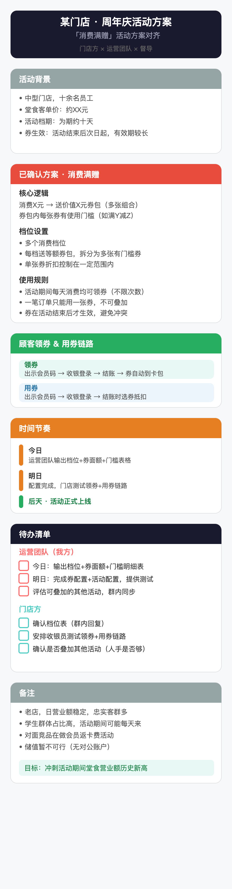

# majia-meeting-svg

一个 Claude Code Skill：把会议逐字稿变成一张手机端可直接转发的 SVG 会议纪要卡片。

## 它做什么

喂入会议录音转写 / 逐字稿，产出一张结构化的 SVG 卡片——色块分模块、checkbox 列待办、时间轴标节奏。所有参会方拿到同一张图，30 秒扫完就知道「定了什么、谁做什么、什么时候」。

**输入**：多方会议的逐字稿 / 录音转写文本  
**输出**：手机端可直接查看的自包含 SVG 文件

## 安装

```bash
claude install-skill https://github.com/maojiebc/majia-meeting-svg
```

或手动克隆到 `~/.claude/skills/majia-meeting-svg/`。

## 使用

```bash
/majia-meeting-svg path/to/transcript.txt
/majia-meeting-svg   # 然后粘贴内容
```

## 示例



[`references/examples/`](references/examples/) 目录下有五个脱敏示例，覆盖不同会议场景：

- **异业合作对齐** — 两个品牌首次合作的资源对齐与分工
- **门店活动方案** — 单店促销活动的机制确认与待办
- **CRM开发需求确认** — 品牌方与技术服务商的需求评审（做/不做/降级）
- **支付核销一体化** — 三方技术对接方案（含完整技术链路流程图）
- **省级会员推进** — 总部与分公司的多议题对齐会

## 视觉特点

- 色块区分模块（红/蓝/绿/橙/紫/灰）
- 白底卡片 + 清晰的文字层级
- Checkbox 式待办清单，按责任方分组
- 时间轴标记关键里程碑
- 提示条标注风险和关键决定
- 圆角、留白、手机优先

## License

MIT
